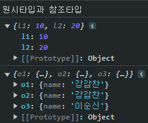

[실습 코드](../section02)

# I. Truthy Falsy
- Boolean 타입이 아니어도 조건으로 사용 가능
  - 값이 없는 경우 falsy 처리
    - undefined
    - null
    - 0
    - -0
    - NaN
    - ""
    - 0n: 매우 큰 수를 표시할때 n을 붙임
  - 배열, 객체, 함수는 비어있어도 값이 있는 것(truthy)으로 처리
    - []
    - {}
    - ()=>{}

# II. 단락 평가
- 논리 연산에서 앞의 조건에서 전체의 결과가 결정되면 뒤의 불필요한 연산을 진행하지 않는 것을 이용해 마치 조건문처럼 코드를 조절하는 것
  - (false) && (any) : and는 앞에서 false가 나오면 뒤에 어떤 구문이 나와도 false이므로 이후 식을 진행하지 않음
  - (true) || (any) : or은 앞이 true이면 뒤의 구문과 관계 없이 true
- truthy, falsy도 적용 
# III. 구조분해할당
- 배열이나 객체의 내용을 분해해서 변수로 할당하는 방식
- 배열의 구조분해 할당: 스코프키워드 [원하는 변수명...] = 분해할당할 배열;
```javascript
let arr = [1,2,3,4];
let [one, two, three] = arr;//4는 따로 저장하지 않음
let [o, t, th, f] = arr;// 4개요소 다 분해 할당
let [a, b, c, d, e] = arr;//배열보다 많으면 undefined
console.log({a,b,c,d,e});
let [a1, b1, c1, d1, e1 = 6] = arr;//기본값을 지정해 null 방지
console.log({a1,b1,c1,d1,e1});
```
- 객체의 구조분해 할당: 스코프키워드 {keyName...}  = 분해할당할 객체;
```javascript
let person = {
    name: "hong gil",
    age: 27,
    hobby: "테니스",
}
let {name, age, hobby} = person;
let {//원하는 변수명으로 변환
    name: name1,
    age: age1,
} = person;
let {name:name2, age:age2, extra} = person;
console.log({name2,age2,extra});// 없는 property > undefined
let {name:name3, age:age3, extra2="ex"} = person;
console.log({name2,age2,extra2});// 초기화 가능
```
- 함수의 매개변수를 받을때 편리하게 사용 가능
```javascript
const printInformation = ({name, age, hobby})=>{
  // console.log(`이름: ${person.name}, 나이: ${person.age}, 취미: ${person.hobby}`);
  // console.log(`이름: ${name}, 나이: ${age}, 취미: ${hobby}`);
  let emptyData = "입력해주세요";
  console.log(`이름: ${name||emptyData}, 나이: ${age||emptyData}, 취미: ${hobby||emptyData}`);
}
printInformation(person);
printInformation({name:"aa"});
```
# IV. Spread Operator, Rest parameter
## A. spread operator
- 객체나 배열을 다른 collection에 삽입하기
  - ...collection 
```javascript
let obj1 = {a:1,b:2};
let obj2={
    ...obj1,
    c: 3,
    d: 4,
};
console.log(obj2);
// 연산 위치에 따라 덮어씌우기도 됨
let obj3 = {
    a: 123,
    b: 456,
    ...obj1
};
console.log(obj3);
```
- 함수에 사용
```javascript
function sum(a,b,c){
    return a+b+c;
}
console.log(sum(...arr1));
```
## B. rest parameter
- 여기서는 스프레드 연산자가 아닌 rest 매개변수라고 읽음
- 매개변수로 ...를 사용하면 받은 매개변수 값을 배열에 넣어 함수에서 사용하도록함
```javascript
//rest parameters
function fncA(...rest){
    console.log(rest);
}
fncA(1,2,3,4);
```
- 따로 이름을 지정해서 받는 경우 앞에 표시
- rest 매개변수의 이름은 자유롭게 사용
- 늘 매개변수의 마직에 위치시켜 남은 모든 매개변수를 받는 것이 목적이므로 ...rest뒤에 매개변수를 입력할 수 없다.
```javascript
function fncB(a, b, c, ...rest){
    console.log({a,b,c,rest});
}
fncB(1,2,3,4,5,6,7);
```
# V. 원시타입과 객체타입

|       | 원시타입                      | 객체타입                    |
|-------|---------------------------|-------------------------|
| 종류    | Number, String, Boolean   | Object, Array, Function |
| 변수의 값 | 값 자체                      | 참조값(메모리 위치)             |
| 복사,수정 | 원본과 다른 메모리 사용(원본에 영향을 안줌) | 참조값을 복사하기때문에 원본에도 영향을 줌 |
## A. 복사
- 원시타입을 복사하는 경우
```javascript
let l1 = 10;
let l2 = l1;
l2 = 20;
console.log({l1,l2});
```
- 객체타입을 복사(대입)하는 경우 
  - a = b: 얕은 복사. 참조값만 복사
    - 의도치않게 원본을 변경시킬 수 있음: side effect 발생 위험
  - {...a}: 깊은 복사. 내부 값 복사
```javascript
let o1 = {name:"홍길동"};
// 얕은 복사
let o2 = o1;
o2.name = "강감찬";//o1도 변경됨
// 깊은 복사
let o3 = {...o1};
o3.name = "이순신";//o3만 변경됨
console.log({o1,o2,o3});
```
>console

## B. 비교
- 리터럴은 논리, 비교 연산자
- 객체 타입 
  - 얕은 비교: 단순 참조위치 비교
    - o1 === o2
  - 깊은 비교: 객체별로 다양한 방법이 있음
    - 문자열로 정렬시키는 내장 함수 사용이 자주 사용됨
      - JSON.stringify(o1)===JSON.stringify(o2); 

# VI. 반복문으로 객체와 배열 순환하기(Iterator)
- 순회: 배열, 객체 등 여러 값의 집합의 요소를 하나씩 돌아가면서 접근하는 것.
- 반복문 사용하거나 내장함수 사용
## A. 배열 순회
- 요소가 순서를 갖는 배열
```javascript
let arr=[1,2,3];
```
- 배열 인덱스 사용하기
```javascript
for(let i = 0; i < arr.length; i++){
    console.log(i+". "+arr[i]);
}
```
- for of 반복문
  - java의 inhanced for문과 유사
  - index를 통한 조건 처리가 안됨
```javascript
for(let item of arr){
    console.log(item);
}
```
## B. 객체 순회
- 객체는 순서가 없음
```javascript
let person = {
    name: "hong",
    age: 27,
    hobby: "drink",
};
```
- Object.keys()를 사용해 key 배열로 반복문 처리하기
```javascript
let personKeys = Object.keys(person);
for(let propertyKey of personKeys){
    console.log(person[propertyKey]);
}
```
- Object.values()를 사용해 value 배열 반복문 처리하기
```javascript
let personValues = Object.values(person);
for(let value of personValues){
    console.log(value);
}
```
- for in 반복문 사용하기
```javascript
for(let key in person){
    const value = person[key];
    console.log(`${key}: ${value}`);
}
```
# VII. 배열 관련 메서드
## A. 요소 조작
```javascript
let arr = [1,2,3];
```
### 1. push();
- 배열의 마지막 요소 뒤에 추가됨
- 여러개를 한번에 삽입 가능
- 삽입 후 배열 길이 반환
```javascript
arr.push(4);//[1,2,3,4]
let arrLength = arr.push(5,6,7);//[1,2,3,4,5,6,7]
```
### 2. pop();
- stack 구조처럼 LIFO(last in fist out) 처리
- 배열의 마지막 요소를 꺼내고 지움
```javascript
let lastEl = arr.pop();
//lastEl: 7, arr: [1,2,3,4,5,6]
```
### 3. shift();
- queue 구조처럼 FIFO(fist in first out) 처리
- 배열의 제일 앞 요소를 꺼내고 지움(나머지 요소들 당겨옴)
```javascript
let firstEl = arr.shift();
//lastEl: 1, arr: [2,3,4,5,6]
```
### 4. unshift();
- 배열의 제일 앞에 요소를 추가하고 다른 요소들을 뒤로 미룸
- 삽입 후 배열 길이 반환
```javascript
arr.unshift(1);
let arrLength = aarr.unshift(-3,-2,-1,0);
```
### 5. slice();
- slice(startIndex, endIndex+1);
- endIndex+1을 생략하면 시작지점부터 끝까지
- startIndex에 음수를 입력하면 배열의 끝에서 자리를 세기 시작
- 배열의 특정 범위를 잘라 새로운 배열로 반환
- 원본배열에는 영향을 안줌
```javascript
let arrA = arr.slice(3,6);//index3,index4,index5
let arrA = arr.slice(3);//index3~index[length-1]
let arrA = arr.slice(-3);//index[length-4] ~ index[length-1]
```
### 6. concat();
- 앞에 놓일 배열.concat(뒤에 추가될 배열);
```javascript
let arrA = [1,2,3];
let arrB = [4,5];
let concatedArr = arrA.concat(arrB); //[1,2,3,4,5]
```
## B. 순회와 탐색
### 1. forEach();
- array.forEach(function (item,idx,arr){...});
- 배열을 index 순서대로 순회하면서 작업 진행
```javascript
let arr = [1,2,3];
arr.forEach((i,idx,arrP)=>{
   console.log({
     item: i,
     index: idx,
     thisArr: arrP
   }); 
});
```
- 내부 콜백에서 안쓰는 매개변수는 굳이 쓰지않아도 됨
```javascript
arr.forEach((i,idx)=>console.log(i+idx));
```
### 2. includes()
- 배열에 해당 요소가 있는지 확인해서 boolean으로 반환
```javascript
arr.includes(3);
```
### 3. indexOf()
- 배열에 해당 요소가 있는 위치(index)를 반환
- 중복값이 있는경우 제일 앞에 있는 요소의 위치만 반환
- 값이 없는 경우 -1 반환
```javascript
arr.indexOf(3);
```
### 4. findIndex()
- findIndex(()=>{...});
- 주로 object가 요소일때 사용
- 내부 콜백의 return이 true인 대상 중 제일 앞 요소의 index 반환
```javascript
arr.findIndex(item=>{
    if(item%2===1)
        return true;
});
```
- 중간처리 없이 조건만 찾는 경우 더 축약
```javascript
arr.findIndex(i=>i===1);
```
### 5. find()
- findIndex와 유사
- 만족하는 요소를 그대로 반환
```javascript
let three= arr.find(item=>item===3);
```
## C. 배열 변형
### 1. filter();
- 콜백함수를 만족하는 요소를 새로운 배열로 만들어 반환
```javascript
let arr =[
    {name: "홍길동", hobby: "soccer"},
    {name: "김유신", hobby: "soccer"},
    {name: "이순신", hobby: "golf"},
];
let soccerTeam = arr.filter(student=>student.hobby==="soccer");
```
### 2. map();
- 배열의 모든 요소를 순회하면서 각각 콜백함수를 실행하고 결과로 이뤄진 배열을 반환
```javascript
let arr = [1,2,3];
let resultArr = arr.map((i,idx)=>{
    console.log(`${i}. ${arr[idx]}`);
    return item * 2;
})
console.log(resultArr);
```
### 3. sort();
- default : 사전순 정렬(숫자의 대소가 아님)
- 원본을 수정
```javascript
let arr = ['v','d','a','c'];
arr.sort();
```
- 대상 비교방식 지정
- 숫자의 경우 
  - 양수가 나오면 b가 a 앞에
  - 음수가 나오면 a가 b 앞에
  - 0이 나오면 변동x
```javascript
let arr = [5,2,1,4,3];
arr.sort((a,b)=>{
  if(a>b)
      return 1;//b, a
  else if(a<b)
      return -1;//a, b
  else
      return 0;// 유지
});
```
- 그냥 부호 문제이므로 
```javascript
arr.sort((a,b)=>a-b);
```
- ASC, DESC
```javascript
arr6.sort((a,b)=>a-b);//1,2,3,4,5
arr6.sort((a,b)=>b-a);//5,4,3,2,1
```
### 4. toSorted()
- sort와 같은 방식
- 단, 원본은 건들지 않음
```javascript
let arr = [5,2,1,4,3];
let sortedArr = arr.toSorted((a,b)=>a-b);
console.log({arr,sortedArr});
```
### 5. join()
- 배열의 모든 요소를 하나의 문자여롤 합쳐줌
- join()
  - default: 구분자를 , 사용
```javascript
let arr = ["he","is","computer"];
let str = arr.join();//he,is,computer
let sepStr = arr.join(" ");//he is computer
```
# IIX. Date 객체
## A. 생성하기
- 생성자 사용
  - parameter로 다양한 형식 사용
```javascript
let date1 = new Date();// default: 현재 날짜
let date2 = new Date("1997-01-01");// 지정한 날짜
let date3 = new Date("1998. 01. 01");
let date4 = new Date("1999/01/01");
```
  - hh:mm:ss 지정하면 시간도 지정
```javascript
let dateTime1 = new Date("2000/01/01/10:10:10");
```
## B. 타임 스탬프
- UTC(세계협정시)인 1970.01.01 00:00:00부터 몇 ms가 지났는지 체크
```javascript
let timeStamp = date1.getTime();
//이것을 Date 객체로 사용하면 같은 시간을 대상으로 함
let date5 = new Date(timeStamp);
```
- 시관관련 연산할때 유용
## C. 시간요소들 추출
- month는 배열처럼 0부터 시작
- 실제 우리가 사용하는 월로 하려면 +1
```javascript
let year = date1.getFullYear();
let month = date1.getMonth()+1;
let day = date1.getDate();
let hour = date1.getHours();
let minute = date1.getMinutes();
let second = date1.getSeconds();
let milliSecond = date1.getMilliseconds();
```
## D. 시간 수정하기
- set{대상}
- 마찬가지로 month는 0~11
```javascript
date5.setFullYear(2000);
date5.setMonth(2);
date5.setDate(30);
date5.setHours(23);
date5.setMinutes(59);
date5.setSeconds(58);
date5.setMinutes(99);
```
## E. 시간을 여러 포멧으로 출력
- 좀더 자세한 컨트롤도 가능
```javascript
console.log(date5.toDateString());//영어식 표시
console.log(date5.toLocaleDateString());//timeZone
```