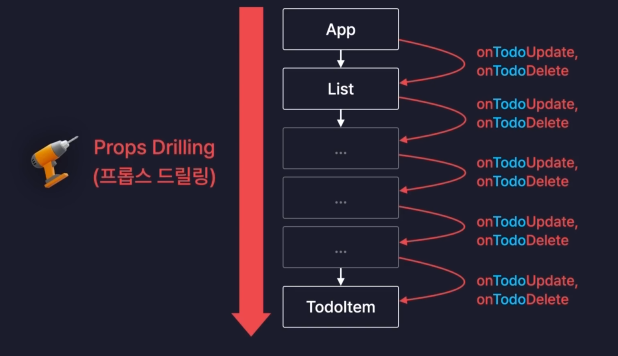

# I. Context?
- Props를 대체하는 자원 공유 방법
- props 단점 
  - 부모 > 자녀의 단방향 자원 전달만 가능
  - 컴포넌트 구조가 여러단계를 거치면 중간의 모든 컴포넌트에서 props를 연계해야함
    - ex) App.jsx > List.jsx > Item.jsx
    - 
- context: 데이터(객체) 보관소
  - props 없이 보관소에서 데이터를 관리
- [section08](../section08)에서 진행

# II. Context 적용하기
## A. props drilling 확인하기
- App.jsx > List.jsx > Item.jsx
  - todos는 list에서 사용하므로 대상 x
  - update, delete를 다루는 함수는 item에서만 사용하므로 대상 o
## B. context 상용하기
### 1. context 생성하기
- 컴포넌트 외부에 context 생성하기
  - 내부에서 생성하면 해당 컴포넌트가 리랜더링될때마다 새 context가 생성됨
- export로 외부에서 사용준비
```jsx
export const TodoContext = createContext();
```
### 2. context 공급 설정하기(Provider)
- `생성해놓은Context.Provider value={{전달할 대상}}`
```jsx
<TodoContext.Provider value={{
    updateTodo,
    deleteTodo,
}}>
    <Editor onCreate={createTodo}/>
    <List
        todos={todos}
    />
</TodoContext.Provider>
```
### 3. 컴포넌트에서 호출해 사용하기
```jsx
const { updateTodo, deleteTodo } = useContext(TodoContext);
const onChangeCheckbox =()=>{
    updateTodo(id);
}
const onDeleteBtn =()=>{
    deleteTodo(id);
}
```
- 단 Context의 value 객체가 하나이기 때문에 한 context에서 관리하는 state가 변경이 되면 memoization과 관계 없이 리랜더링된다.
### 4. Context 분리하기
- 기준: 변경될 수 있는 값과 변경되지 않는 값
  - mutable: todos 처럼 사용자가 변경할 수 있는 값
  - immutable: function과 같이 정해지면 변경하지 않을 
- context 분리
```jsx
export const TodoStateContext = createContext();
export const TodoDispatchContext = createContext();
```
- 변경없을 데이터(함수)를 memoize해서 전달할 함수 준비
```jsx
const memoizedDispatch=useMemo(()=>{
    return {
        updateTodo,
        deleteTodo,
    }
});
```
- context 적용
```jsx
    return (
    <div className="App">
        <Header/>
        <TodoStateContext.Provider value={todos}>
            <TodoDispatchContext.Provider value={memoizedDispatch}>
                <Editor onCreate={createTodo}/>
                <List
                    todos={todos}
                />
            </TodoDispatchContext.Provider>
        </TodoStateContext.Provider>

        <Footer/>
    </div>
)
```
- 사용
```jsx
const todos = useContext(TodoStateContext);
const {updateTodo, deleteTodo} = useContext(TodoDispatchContext);
```