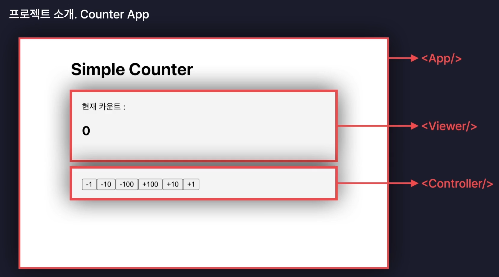

# I. State
[실습 코드](../section05/src/components/StateComponent.jsx)
- 동적으로 처리할 여러 상태를 관리. 
- react component에서 state에 따라 리랜더링을 시행시킴
## A. 사용하기위한 import
```jsx
import {useState} from "react";
```
## B. 선언
```jsx
//     상태    상태변경함수            기본값
const [state, setState] = useState('initValue');
```
## C. 이벤트 리스너에 연결하기
```jsx
return (
    <>
        <h1> {state} </h1>
        <button
            onClick={()=>{
                setState(state+1);
            }}
        >
            +
        </button>
    </>
)
```
## D. toggle로 사용하기
- 그냥 flag로 사용할때는 boolean이나 number를 사용하는 것도 유용
```jsx
    <h1>system: {light}</h1>
    <button
        onClick={()=>{
            setLight(light === "ON" ? "OFF":"ON");
        }}
        style={{
            background: light==="ON"?"#fff":"#000",
            color: light==="ON"?"#000":"#FFF"
        }}
    >
        전구 {light==="ON"?"켜기":"끄기"}
    </button>
```
## E. props와 state
- props로 받아서 state 적용
```jsx
const Bulb = (props)=>{
    const {light} = props;
    console.log("bulb!!!");// re-render check
    return (
        <div>
            {
                light==="ON"
                ?<h1 style={{background:"orange"}}>ON lamp</h1>
                :<h1 style={{background:"gray"}}>OFF...</h1>
            }
        </div>
    )
}
//...

<Bulb light={light}></Bulb>
```
- 리엑트에서 리-랜더가 발생하는 원인 
  - 자신의 state 변경
  - 제공받는 props 변경
  - 부모 컴포넌트의 state 변경(자신과 관계 없는 state라도)
- 서로 관계없는 state는 분리해주는 것이 좋음
  - 부모를 공유하는 경우 다른 컴포넌트도 리랜더 되는 것을 방지
```jsx
const StateComponent = ()=>{
    //useState는 각 컴포넌트에서 정리
    return (
        <>
            <Bulb/>
            <Counter/>
        </>
    );
}
```
## F. 사용자 입력 관리
### 1. input(text, date)
- state로 관리
- 이벤트리스너 함수로 변경 감지
- input tag의 value에 값 변경 반영
```jsx
const [name, setName] = useState("");// 1. state

<input 
    placeholder="name" 
    // 2. event listener - function
    onChange={e=>setName(e.target.value)} 
    // update state value
    value={name}
/>
<br/>
{name}
```
### 2. select box
- list를 사용해 편하게 사용
```jsx
const [nation, setNation] = useState("");
const nationList = ["한국","미국","영국"];
```
```jsx
    <select
        value={nation}
        onChange={onChangeNation}
    >
        <option value="">선택</option>
        {nationList.map(nationOpt=>{
            return <option key={nationOpt+1}>{nationOpt}</option>
        })}
    </select>
```
- 필요에 따라 value와 name 등 다양한 옵션을 사용하기도 함.
  - tag의 value는 서버로 전달할 값
  - tag의 content(<>content</>)는 사용자에게 보여줄 값
### 3. textarea
- input과 같음
```jsx
    <textarea
        value={introducingText}
        onChange={onChangeIntroducingText}
    />
```
### 4. 여러 입력을 하나의 state에서 관리하기
#### a. state를 합쳐 obj로 관리하기
```jsx
const [user, setUser] = useState({
  name:"",
  birth:"",
  nation:"",
  introducingText:"",
});
```
#### b. 입력 태그들의 name을 key로 변경
```jsx
  <div>
      <input
          name="name"
          //...
      />
  </div>
  <div>
      <input
          name="birth"
          //...
      />
  </div>
  <div>
      <select
          name="birth"
          //...
      >
              //...
  </div>
  <div>
      <textarea
          name="introducingText"
          //...
      />
  </div>
```
#### c. 이벤트 리스너 함수 합치기(선택)
```jsx
const onChangeUser=e=>{
  const {name, value} = e.target;
  setUser({
    ...user,
    [name]:value,
  });
};
```
- 만약 따로 처리할 것이 있다면(ex) nation)
```jsx
const onChangeNation =e=>{
    setUser({
      ...user,//다른 값 복사
      nation: e.target.value,// 변경 적용
    });
}
```
#### d. jsx tag에 변경사항(value, onChange) 반영하기
```jsx
  <input
        name="name"
        placeholder="name"
        onChange={onChangeUser}
        value={user.name}
    />
    <br/>
    {user.name}
```
# II. Ref: reference Object 생성
## A. 기능
- 컴포넌트 내부의 변수로 활용 가능
- useState와 비교
  - 공통점
    - 컴포넌트 내부의 변수로 활용 가능
  - 차이점
    - useState : 값이 변경되면 re-rendering 
    - useRef   : 값이 변경되도 랜더링되지 않음
      - 랜더링하지 않는 변수 사용
        - 내부에서만 작동하는 값으로 사용하기 좋음
      - V-DOM 접근
## B. 선언하기
- `import {useRef} from react;`
```jsx
    const refObject = useRef();
```
- 구조
  > {current: 값}
## C. 값 변동에 대한 반응
- 어떤 element에 이벤트 리스너 지정
```jsx
onClick(()=>{
    regObject.current++;
    console.log(regObject.current);
})
```
- 값은 변해도 리랜더링을 진행하지 않는다
## D. DOM elements 접근하기
- Ref를 위한 객체 생성
- 대상 DOM element ref attribute 지정
- onClick callback
- 콜백에 ref.current로 DOM 접근

- name 예시
```jsx
const nameInputRef = useRef();
const onSubmit=()=>{
  if(user.name===""||user?.name.trim()==="")
    nameInputRef.current.focus();
}

//... return
<input
        name="name"
        placeholder="name"
        onChange={onChangeUser}
        value={user.name}
        ref={nameInputRef}//ref로 지정
/>
```
## E. Ref(값) vs 일반 상수
- 값이 변경되면 결국 리랜더링이 진행된다. 이때
  - Ref는 랜더링 과정을 무시한다
  - 상수는 함께 랜더링되어 초기화 된다.
- 물론 컴포넌트 외부에 선언해서 사용해도 리랜더링에서 제외되므로 사용할 수 있지만
- 같은 컴포넌트를 두번 호출하면 두 컴포넌트가 하나의 대상을 공유하게 되어 원하는 기능을 해칠 수 있다
  - 가능한 전역변수는 사용하지 않는 것이 좋음

# III. react Hooks
[실습](../section05/src/components/Hook_example.jsx)
- use-로 시작하는 함수
```jsx
function useInput(){...}
```
- class component >>> function component
  - class 컴포넌트는 문법이 복잡해 그것을 함수형에서 사용하도록함 
  - State, Ref, ... >>> useState, useRef, ...
- 주의사항
  - 함수 컴포넌트 내에서만 사용
  ```jsx
  import {useState} from "react";
  // const globalState = useState("error");
  const Hook_example = ()=>{ //...
  ```
  - 조건문, 반복문 등 내부 스코프에서는 호출 불가. 
    - 컴포넌트 스코프에서 생성한 것은 사용은 가능
  ```jsx
  const [state, setState] = useState(0);
  // if(state > 0)
  //      const conditionState = useState(32);
  // for(let i = 0;i<10;i++)
  //     const iterateState = useState(i);
  return <h1>hook example</h1>;
  }
  ```
## A. customizing Hook
- 반복적 처리를 별도의 함수로 빼서 사용
  - 이름이 use로 시작할 것
  - return과 함께 사용
  - hook도 따로 보관
```jsx
function useInput(){
  const [input,setInput] = useState("");
  const onChangeInput = e=>{
    // 중간 처리 코드
    setInput(e.target.value);
  }
  return [input,onChangeInput];
}
```
 
# IV. 실습 프로젝트: [카운터 앱](../section05/src/counterApp)



<details >
  <summary>1. state는 어디서 관리할 것인가? </summary>
- 자식 컴포넌트 사이에서 직접 데이터를 주고받을 수없다<br/>
- 부모 컴포넌트에서 state 사용<br/>
<b>: App.jsx</b>
</details>

